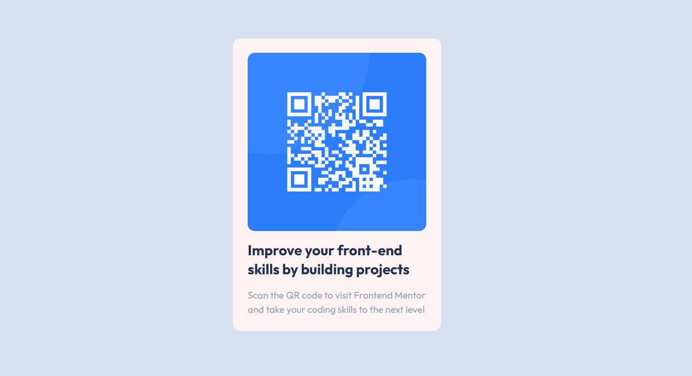
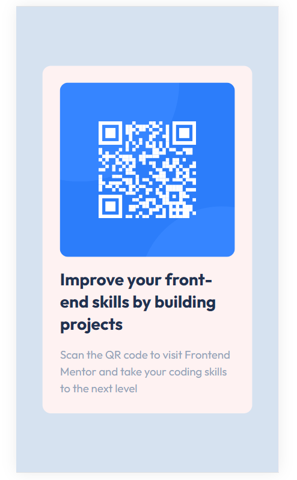

# Frontend Mentor - QR code component solution

This is a solution to the [QR code component challenge on Frontend Mentor](https://www.frontendmentor.io/challenges/qr-code-component-iux_sIO_H). Frontend Mentor challenges help you improve your coding skills by building realistic projects. 

## Table of contents

- [Overview](#overview)
  - [Screenshot](#screenshot)
  - [Links](#links)
  - [Built with](#built-with)
  - [What I learned](#what-i-learned)
  - [Useful resources](#useful-resources)
- [Author](#author)

## Overview
Simple QR Code component
### Screenshot



### Links

- Solution URL: [GitHub](https://github.com/TuanAnh45468/QRCode)
- Live Site URL: [Netlify](https://qrcodetuananh45468.netlify.app/)


### Built with

- Semantic HTML5 markup
- Flexbox
- Mobile-first workflow
- [TailwindCSS](https://tailwindcss.com/) - TailwindCSS


### What I learned

Through this exercise I learned how to use flex box and apply tailwindCSS (custom styles)

To see how you can add code snippets, see below:

```css
@layer base {
  h1{
  @apply text-2xl font-bold text-dark-blue;
  }

  p{
    @apply text-slate-400;
  }
}
```
### Useful resources

- [Learn CSS](https://web.dev/learn/css) - This helped me understand flexbox and other CSS concepts clearly.
- [TailwindCSS](https://tailwindcss.com/docs) - This is TailwindCSS documentation to look up

## Author

- Frontend Mentor - [@TuanAnh45468](https://www.frontendmentor.io/profile/TuanAnh45468)
